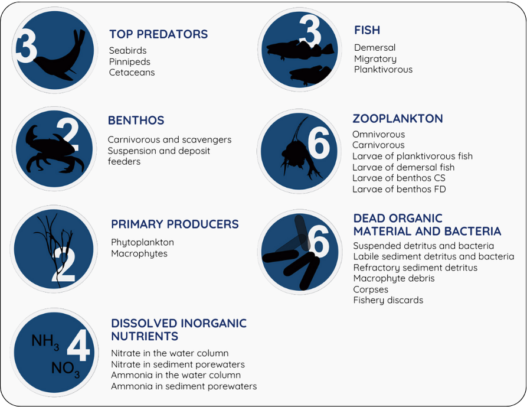
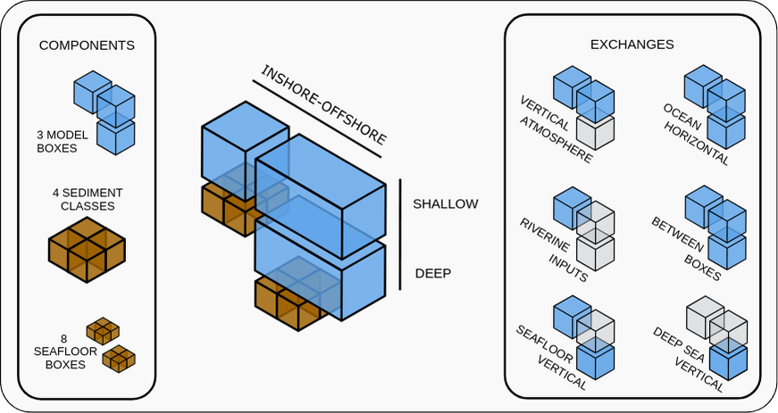
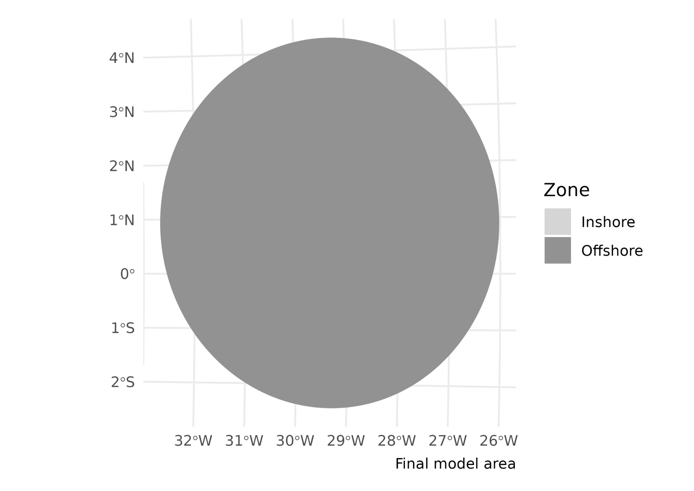
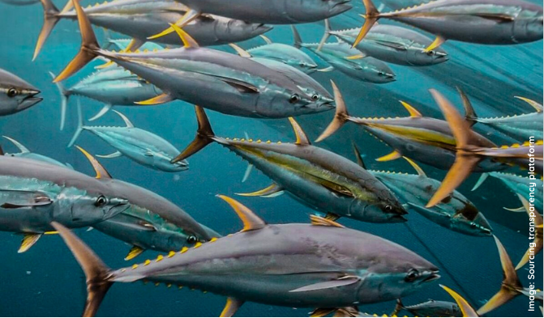
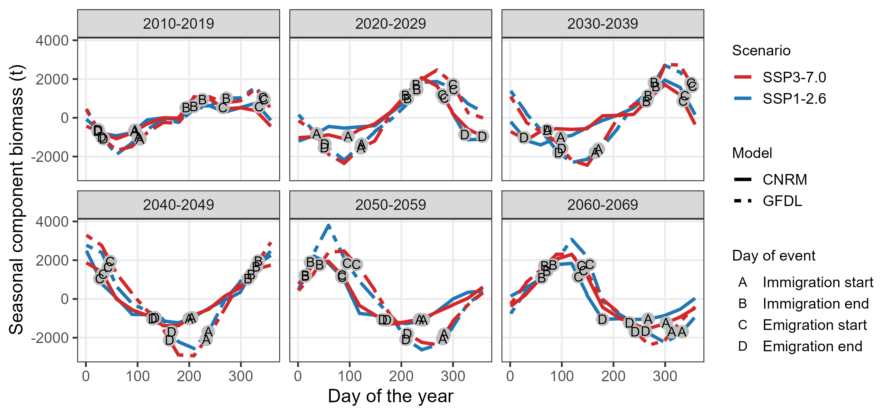
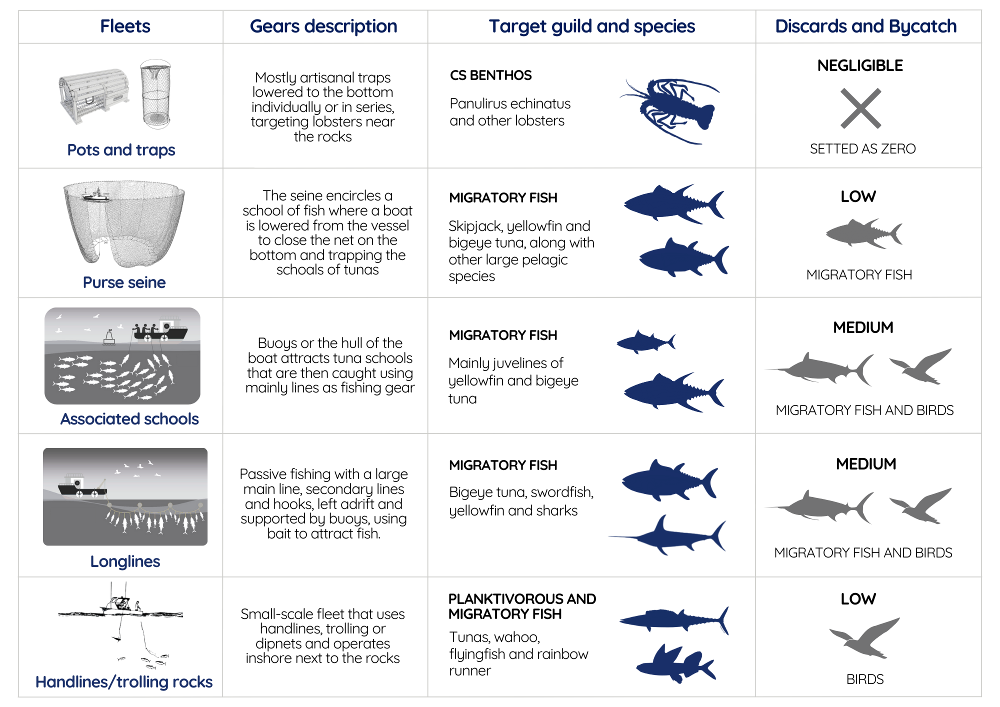
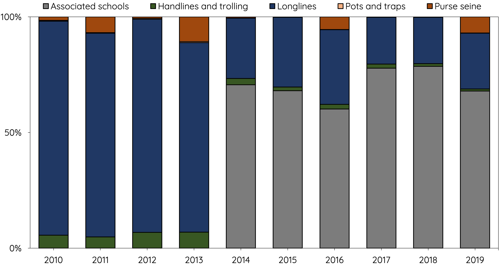

```{r setup, include=FALSE}

knitr::opts_chunk$set(echo = FALSE, warning = FALSE, message = FALSE, fig.align = "left")

library(tidyverse)
library(sf)
library(gt)

source("@_Region file.R")
Period <- "2010-2019"

table_nums <- captioner::captioner(prefix = "Table ")

table.ref <- function(x) stringr::str_extract(table_nums(x), "[^:]*")

model <- StrathE2E2::e2e_read("SPSP", Period, models.path="Files") # Load implementation

Area <- read.csv(str_glue("Files/SPSP/{Period}/Param/event_timing_SPSP.csv")) %>% 
  filter(str_detect(Description, "km2")) %>% 
  .$Value                                                     # Get size of the model domain

Area
```

# Introduction {.unnumbered}

This document describes the configuration of StrathE2E for the Saint Peter and Saint Paul Archipelago (SPSP) Marine Protected Area (MPA) off Brazil (South Mid-Atlantic Ridge) and its parameterisation to enable stationary state fitting for both the baseline period (2010-2019) and future projections (2020-2069). These represent contrasting periods of environmental conditions.

Volumetric and seabed habitat data define the physical configuration of the system. We regard these as being fixed in time. Similarly, we regard the physiological parameters of the ecology model as being fixed in time. Some of these are set from external data. The remainder are fitted, as detailed here. Changes in the model performance between the different time periods therefore stem from the hydrodynamic, hydro-chemical and fishery driving data. These are detailed in the ecological drivers and fishing fleet sections.

In the StrathE2E model all marine lifeforms are explicitly or implicitly accounted for, but aggregated into coarse groups or 'guilds' defined mainly by feeding characteristics and diet preferences (Figure \@ref(fig:guilds). All state variables, except macrophytes, are expressed solely in terms of nitrogen mass. For more information about the StrathE2E model check the [documentations](http://www.marineresourcemodelling.maths.strath.ac.uk/strathe2e/) available.

```{r guilds, echo=FALSE, fig.cap="Ecological guilds of the StrathE2E model (Heath, 2021).", out.width = '100%'}

```

> Department of Mathematics and Statistics, University of Strathclyde, Glasgow, UK, E-mail: [m.heath\@strath.ac.uk](mailto:m.heath@strath.ac.uk){.email}
>
> Oceanographic Institute, University of Sao Paulo, Brazil, E-mail: [juliapetroski\@usp.br](mailto:juliapetroski@usp.br){.email}
>
> The code written to support this parameterisation is available on [github](https://github.com/Jack-H-Laverick/MA.SaoPedroSaoPaulo).

<br>

# Model Domain {.unnumbered}

The SPSP MPA is located in the Equatorial Atlantic and is one of the five Brazilian oceanic islands, encompassing approximately 450,000 km² of the Brazilian waters, which represents 11.5% of the entire Brazilian Exclusive Economic Zone (EEZ). Situated along the South Mid-Atlantic Ridge, it is 1,010 km from the Brazilian coast and 1,890 km from Senegal, Africa. The archipelago consists of five main rocks and five smaller islets (0°55ʼN; 29°21ʼW), with an emerging area of about 0.011 km².

The model splits the domain into three zones, inshore/shallow, offshore/shallow, and offshore/deep (Figure \@ref(fig:overhang)). The inshore/shallow zone covers waters shallower than 60 m or within 20 km from shore. The offshore zone encompasses the remaining area of the model domain and is further divided into a shallow and a deep layer. The shallow layer represents water from the surface to 60 m depth, and shares a boundary with the inshore shallow zone. The offshore/deep zone covers the same area as the offshore/shallow zone, but represents water between 60 m and 600 m deep. There is a second internal boundary between the two offshore zones.

```{r overhang, echo=FALSE, fig.cap="The spatial structure of StrathE2E; Ocean volumes and seafloor habitats. StrathE2E is built around a simplified spatial structure which represents shelf seas. These spatial units are connected to each other and to boundaries as shown to the right. The volumes connected to each spatial component are highlighted in blue.", out.width = '100%'}

```

The seafloor within the StrathE2E model can be classified into eight habitat types. These include three sediment classes: fine (muddy, 1), medium (sandy, 2), and coarse (gravel, 3), with the fourth class (rock, 0) indicating the absence of soft sediment. These sediment classes are defined in both the inshore/shallow and offshore/deep zones. However, within the SPSP domain, only the rock class was considered. Even the inshore area with shallower depths is primarily composed of large rocks (Cesar, 2004).

As of V.4, StrathE2E2 can represent an offshore "overhang" where open ocean does not contact the seafloor (Figure \@ref(fig:overhang)). The perimeter of the offshore zone in the model domain is the edge of the MPA, with a "false bottom" (overhang) that exchanges with the deepsea. By using the MPA to define the model domain, we accurately represent the protected status of the SPSP. The total area of the model is 431,765.11 km².

```{r domain, echo=FALSE, fig.cap="Map of the model domain. StrathE2E defines seabed sediment habitats as inshore (light gray) or offshore/overhang (dark gray). Within each zone, three sediment classes can be represented -- fine (muddy, 1), medium (sandy, 2) and coarse (gravel, 3). A fourth class (rock, 0) represents an absence of soft sediment. Only rock habitat was considered in the SPSP implementation. Note that the majority of the SPSP model domain is comprised by the 'overhang', which does not contact the sea floor.", out.width = '100%'}

```

# Fixed Physical {.unnumbered}

## Background {.unnumbered}

#### Water column inshore/shallow and offshore/deep zone area proportions and layer thicknesses; seabed habitat area proportions and sediment properties: {.unnumbered}

The depth boundary between deep and shallow layers was determined using vertical diffusivity values from NEMO-MEDUSA [@yool13] and mixed layer depth from Globcolour (www.globcolour.info/). The shallow-deep layer division was set at 60 m, with a bottom depth of 600 m for the deep layer. The offshore zone then extends to the edge of the EEZ, but with a "false bottom" that exchanges with the deep sea (without seafloor). In the coastal zone, the polygon is defined for areas shallower than 60 m or within 20 km of the coast.

#### Parameters for relationship between median grain size, sediment porosity and permeability. Permeability is used as the basis for estimating hydraulic conductivity which is a parameter in the representation of sediment processes in the model: {.unnumbered}

Porosity (proportion by volume of interstitial water) and permeability of each sediment habitat were derived from median grain sizes using empirically-based relationships.

$$log_{10}(porosity) = p_3 + p_4\left(\frac{1}{1+e^{(\frac{-log_{10}(D_{50})-p_1}{p_2})}}\right)$$ D~50~ = median grain size (mm); parameters p~1~ = -1.227, p~2~ = -0.270, p~3~ = -0.436, p~4~ = 0.366 [@heath21]

$$permeability = 10^{p_5}∙D_{50}^{*p_6}$$

where D~50~\* = 0.11 ≤ D~50~ ≤ 0.50 p~5~ = -9.213, p~6~ = 4.615 [@heath15].

These relationships are coded into the StrathE2E2 R-package with the parameters in the csv setup file for the SPSP model. The parameters are probably a reasonable starting point for any future model of a new region. Derivation of the parameters is described in the following text sub-sections.

#### Parameters for in-built relationship between sediment mud content, and slowly degrading (refractory) organic nitrogen content of seabed sediments (see description in this document): {.unnumbered}

Values for each sediment type derived from parameterised relationships between total organic nitrogen content of sediments (TON%, percent by weight), mud content (mud%, percent by weight) and median grain size (D~50~, mm).

$$mud\% = 10^{p_7}∙𝐷_{50}^{𝑝_8}$$ p~7~ = 0.657, p~8~ = -0.800

$$TON\% = 10^{𝑝_9}∙mud\%^{𝑝_{10}}$$

p~9~ = -1.965, p~10~ = 0.590

Proportion of TON estimated to be refractory = 0.9

These relationships, along with their parameters, are documented in the North Sea implementation of the StrathE2E2 package [@heath21]. While there may be regional variations, these relationships serve as a reasonable starting point for the SPSP implementation. The StrathE2E2 R-package encodes these relationships, with the parameters specified in the CSV setup file. Derivation of the parameters is described in the following sub-sections.

## Model area proportions {.unnumbered}

```{r area_proportions_cap}

tab_area_proportions_cap <- table_nums(name = "tab_area_proportions", 
    caption = stringr::str_glue("Area-proportions of the inshore and offshore zones and the thicknesses of the                                        water column layers. The sea surface area of the model domain is an estimated                                         {Area} km^2^."))
```

[Copied from SBS, still needs compilation for SPSP]

`r table_nums("tab_area_proportions")`

```{r area_proportions}

data_frame(Property = c("Sea-surface area proportion",
                        "Upper layer thickness (m)",
                        "Lower layer thickness (m)"),
           `Inshore/shallow` = c(model[["data"]][["physical.parameters"]][["x_shallowprop"]], 
                                 model[["data"]][["physical.parameters"]][["si_depth"]], 
                                 NA),
           `Offshore/deep` = c(1 - model[["data"]][["physical.parameters"]][["x_shallowprop"]], 
                               model[["data"]][["physical.parameters"]][["so_depth"]], 
                               model[["data"]][["physical.parameters"]][["d_depth"]])) %>% 
  gt() %>% 
  fmt_number(columns = c("Offshore/deep", "Inshore/shallow"), decimals = 4, use_seps = FALSE)


```

```{r habitat_proportions_cap}

tab_habitat_proportions_cap <- table_nums(name = "tab_habitat_proportions", 
    caption = stringr::str_glue("Area proportions and other characteristics of the seabed habitat classes defined in the model by depth, rock or sediment type. The sea surface area of the model domain is an estimated {Area} km^2^. Grain size is the median in mm, Permeability in units of m^2^, nitrogen content in %dw."))
```

`r table_nums("tab_habitat_proportions")`

```{r habitat_proportions}

physical <- read.csv(str_glue("Files/SPSP/{Period}/Param/physical_parameters_SBS.csv"))
  
proportions <- which(str_detect(physical$Description, "Area_proportion"))
porosity <- which(str_detect(physical$Description, "Defined_porosity"))
permeability <- which(str_detect(physical$Description, "Defined_permeability"))
nitrogen <- which(str_detect(physical$Description, "Defined_total_N"))
grain <- which(str_detect(physical$Description, "grain_size"))

depth_vector <- c(rep(c("Shallow"), each = 4), rep(c("Deep"), each = 5))
zone_vector <- c(rep(c("Inshore"), each = 4), rep(c("Offshore"), each = 5))

data_frame(Habitat = c("S0", "S1", "S2", "S3", "D0", "D1", "D2", "D3", "OV"),
           Depth = depth_vector,
           Zone = zone_vector,
           Sediment = rep(c("None (Rock)", "Fine", "Medium", "Coarse", "None (Rock)", "Fine", "Medium", "Coarse", "Overhang")),
           `Area Proportion` = physical$Value[proportions],
           `Grain size` = c(0, physical$Value[grain[1:3]], 0, physical$Value[grain[4:6]], NA),
           Porosity = c(NA, physical$Value[porosity[1:3]], NA, physical$Value[porosity[4:6]], NA),
           Permeability = c(NA, physical$Value[permeability[1:3]], NA, physical$Value[permeability[4:6]], NA),
           `Nitrogen content` = c(NA, physical$Value[nitrogen[1:3]], NA, physical$Value[nitrogen[4:6]], NA)) %>% 
  group_by(Zone, Depth) %>% 
  gt() %>% 
  fmt_number(columns = c("Area Proportion", "Grain size", "Porosity", "Permeability", "Nitrogen content"), 
                         decimals = 4, use_seps = FALSE) %>% 
  cols_align(align = 'center',
             columns = vars(`Area Proportion`, `Grain size`, Porosity, Permeability, `Nitrogen content`)) %>% 
  tab_options(row_group.background.color = "whitesmoke")


```

## Daily disturbance rates {.unnumbered}

[Copied from SBS, still needs compilation for SPSP]

To calculate the natural disturbance rate, we needed depth-averaged current speeds (including tidal influence) and wave data. We used data products from Copernicus Marine Data; however, only surface tide components were available instead of depth-averaged values, and the depth-averaged current speeds did not include tides. Therefore, we approximated the influence of tides on the depth profile by assuming that the extra surface speed diminishes with depth at a certain decay rate. We employed a rough approximation for non-stratification and a flat bottom from the National Oceanography Centre (NOC). The equation assumes a constant speed in the upper half of the water column and attenuation in the lower half due to bottom friction, with speed decaying to zero at the bottom.

$$U_{} = U_{\text{current}} + \frac{U_{\text{tides }}}{1.07}$$ $$V_{} = V_{\text{current}} + \frac{V_{\text{tides }}}{1.07}$$

We used the Copernicus toolbox for subsetting the specific variables, the SBS domain, and the desired period via Command Line Interface (CLI), then post-processed the data in R. Since the Copernicus Marine Data Store only hosts recent data for public download, we used data from 2022, the oldest full annual cycle available with all three variables. Details about the products used below.

Waves: We used the Global Ocean Waves Analysis product (DOI: 10.48670/moi-00017) with a 1/12-degree resolution. The parameters used every 3 hours were: significant wave height, mean wave direction, and primary swell wave period. Specific variables included Sea surface wave significant height (VHM0, m), Sea surface wave direction (VMDR, °), and Sea surface primary swell wave mean period (VTM01SW1, s).

Currents: We used the Global Ocean Physics Analysis and Forecast product (DOI: 10.48670/moi-00016) with a 1/12-degree resolution. The 6-hourly parameters used were Eastward sea water velocity (uo, m/s) and Northward sea water velocity (vo, m/s).

Tides: We used the Global Ocean Physics Analysis and Forecast product (DOI: 10.48670/moi-00016) with a 1/12-degree resolution. The 1-hourly parameters used were Surface sea water x velocity due to tide (utide, m/s) and Surface sea water y velocity due to tide (vtide, m/s).

Even though the grid is shared, there were coastal cells with currents but missing data for waves and tides. We interpolated missing coastal cells using the Voronoi tessellation method (nearest neighbor). We also interpolated the depth-averaged currents and waves to match the hourly timestep of the tides using the `approx` function.

We combined all data into a single dataset and applied functions from the `bedshear` package to calculate bed shear stress for the six habitat types.

## Sediment porosity {.unnumbered}

Log-transformed porosity has been shown to have a sigmoidal relationship with log~10~(median grain size) (D~50~, mm) [@wilson18]:

$$log_{10}(porosity) = p_3 + p_4\left(\frac{1}{1+e^{(\frac{-log_{10}(D_{50})-p_1}{p_2})}}\right)$$

We use this relationship to calculate porosity for sea bed sediments in the SPSP (`r table.ref("tab_habitat_proportions")`), using an alternative parameterisation to Wilson [@pace21]. This alternative set of parameters extends the relationship to fine, muddy sediments (`r table.ref("tab_porosity")`).

```{r porosity_cap}

tab_porosity_cap <- table_nums(name = "tab_porosity", 
    caption = "The four parameters for the function relating sediment porosity to median grain size. From Pace et al. (in review)")
```

`r table_nums("tab_porosity")`

```{r tab_porosity}

d50_to_pore <- which(str_detect(physical$Description, "porosity_and_grainsize"))

data_frame(Parameter = paste0("P", 1:4),
           `Fitted value` = physical$Value[d50_to_pore]) %>%
  pivot_wider(names_from = Parameter, values_from = `Fitted value`) %>% 
  gt()

```

## Hydraulic conductivity {.unnumbered}

Hydraulic conductivity (H, m.s^-1^) represents the ease with which fluids flow through the particle grain matrix. The related term 'permeability' (m^-2^) is a measure of the connectedness of the fluid filled void spaces between the particle grains. Permeability is a function only of the sediment matrix, whilst conductivity is a function of both the sediment and the permeating fluid, in particular the fluid viscosity and density. Hydraulic conductivity is related to permeability by:

$$H = Permeability∙fluid\;density∙\frac{𝑔}{dynamic\;viscosity}$$ where: seawater density = 1027 kg.m^-3^ at salinity 35 and temperature 10°C; seawater dynamic viscosity = 1.48 x 10^-3^ kg.m^-1^.s^-1^ at salinity 35 and temperature 10°C; g = acceleration due to gravity = 9.8 m.s^-1^

Hence, $H = Permeability · 6.8004·10^6$ (m.s^-1^ at salinity 35 and temperature 10°C)

Whole sediment permeability can be related to the proportion of sediment classed as mud (D~50~ \< 62 μm) [@pace21]. In this model implementation, this relationship is utilized for internal calculations.

## Sediment organic nitrogen content {.unnumbered}

The magnitude of the static (refactory) organic nitrogen detritus pool in each sediment type is a required input to the model. The code includes an option to impute values from empirical relationships between total organic nitrogen (TON) and mud content, and between mud content and median grain size. This relationship has been documented in the North Sea implementation [@heath21]. For the SPSP implementation, the total nitrogen content is internally calculated and based on that relationship.

# Fixed biological {.unnumbered}

## Configuration parameters {.unnumbered}

### Assimilation efficiencies for each living guild in the model. {.unnumbered}

Fixed parameters defining the proportion of ingested mass of food that contributes to new body tissue, after subtracting defecation and the metabolic costs of digestion and synthesis [@heath12].

### Biomass loss rates due to temperature-dependent metabolism for each living resource guild. {.unnumbered}

Proportion of biomass lost to ammonia per day due to non-feeding related metabolism at a given reference temperature. Rates for individual guilds broadly related to typical body mass of representative species. Temperature dependency following a Q~10~ function.

### Q~10~ values for temperature dependent processes, and the Q~10~ reference temperature. {.unnumbered}

Separate Q10 values for autotrophic uptake of nutrient, heterotrophic feeding, and heterotrophic metabolism based on literature data.

### Light intensity required to saturate autotrophic nutrient uptake. {.unnumbered}

Light saturation intensity for nutrient uptake cannot be treated as a fitted value since it is confounded with other uptake parameters. Value estimated from survey of laboratory experiments.

### Annual weight specific fecundities of planktivorous and demersal fish guilds and the two benthos guilds in the model (suspension/deposit feeders and carnivore/scavenge feeders). {.unnumbered}

Guild-level values derived by surveying the literature.

### Harvestable biomass density threshold for each resource guild. {.unnumbered}

The living resource guilds in the model represent a mixture of harvestable and non-harvestable species, especially the invertebrate guilds. The density threshold parameter sets a limit for the guild biomass below which the harvestable species are assumed to be exhausted. Values set from analysis of trawl, plankton and benthos survey species biomass compositions.

### Minimum inedible biomass of carnivorous zooplankton. {.unnumbered}

The carnivorous zooplankton guild is a key component of the food web, predated on by all the fish and top-predators. However it represents an extremely diverse range of fauna many of which are not edible in significant quantities by the guild predators, e.g. scyphomedusae. A minimum edible threshold is set to ensure that the guild as a whole cannot be extirpated by predation. The value is a rough estimate of scyphomedusae biomass.

## Event timing parameters (not fitted) {.unnumbered}

### Spawning and recruitment start and end dates for fish and benthos {.unnumbered}

We gathered the spawning and recruitment periods for each guild based on literature regarding the main species, described below. In the model the annual weight-specific fecundity is assumed to be shed uniformly between the start and end dates of spawning. The annual cohort of larvae/juveniles of each fish and benthos guild is assumed to recruit to the settled stage at a uniform daily rate between the start and end dates.

#### Planktivorous {.unnumbered}

Due to the abundance of flyingfish (*Cypselurus cyanopterus*) and its ecological importance in the region - comprising 90% of the diet of large pelagics such as tuna, sharks, and seabirds (Vaske-Jr, 2000) - we selected it to represent the spawning period of the planktivorous guild. The flyingfish appears to replenish its stock through seasonal summer reproduction, with a spawning period from December to March, coinciding with the peak concentrations of tuna in the SPSP (Lessa et al., 1999; Pinheiro et al., 2011). It is worth noting that this appears to be the general spawning trend of almost all pelagic species whose reproductive cycle has been studied so far in the SPSP (Soares et al., 2009). We utilized the recruitment period of flyingfish off the northeastern coast of Brazil, which occurs between April and June, peaking in May (Lessa et al., 2004).

Based on that, the spawning period for the planktivorous guild was set from December 1st to March 31st, and the recruitment period from April 1st to June 30th.

#### Demersal {.unnumbered}

Due to the lack of specific information on demersal fish spawning periods in the region, we assumed that spawning peaks during winter and spring, extending into summer, with peaks in August and November. For modelling purposes only, we used the June to November spawning period reported for the rock hind grouper (*Epinephelus adscensionis*) in Saint Helena and Ascension Island, assuming similar reproductive behavior for demersal fish on oceanic islands in the South Atlantic.

#### Carnivorous and scavengers benthos {.unnumbered}

The CS benthos species in the SPSP region include crabs, lobsters, shrimps, and cephalopods. Crab reproduction in the SPSP appears to occur year-round, with a peak during the warmer months of spring and summer (Soares et al., 2009). For lobsters, while specific studies on SPSP spawning period are lacking, reports from Saint Helena Island, indicate that lobsters enter early reproductive stages from October 1st to December 31st, with a closed season for fisheries from January to the end of March due to advanced reproductive stages (St Helena, 2012; 2022). Based on this information, the spawning period for the CS benthos guild was set from January 1st to March 31st, while the recruitment period from April 1st to June 30th. Due to the lack of specific recruitment data, we defined the recruitment as starting 30 days after the end of the spawning period and lasting for 120 days.

#### Deposit and filter benthos {.unnumbered}

There is limited research on the reproductive activity of DF benthos in the SPSP region. The only available information we found indicates that the high density of Brachyura zoea larvae observed during September and October suggests a reproductive period in these months (Díaz, 2007). We applied the same spawning and recruitment periods used for the FD benthos guild in the South Brazil Bight implementation (See X source). Thus, the spawning period is set from September 1st to February 1st, and the recruitment period from August 1st to January 1st.

```{r event_cap}

tab_event_cap <- table_nums(name = "tab_event", 
    caption = "Biological event timing parameters, constant across the time periods. The data are processed in the model setup to calculate the immigration flux parameters needed in the ecology model. Spawning and recruitment durations were established assuming a month with 30 days.")
```

`r table_nums("tab_event")`

```{r tab_migrant, fig.cap = tab_event_cap}

data_frame(Parameter = model[["data"]][["biological.events"]][["Description"]] %>% 
                        str_replace_all("_", " "),
           Value = model[["data"]][["biological.events"]][["Value"]]) %>% 
  .[1:16,] %>% 
  gt() %>%
  fmt_number(
    decimals = 0,
    use_seps = FALSE
  )

```

### Extra-domain stock biomass of migratory, and the proportion invading the domain each year. Start and end dates for the annual invasion, and start and end dates for the emigration. (see description below). {.unnumbered}

The migratory fishes in the region are part of a broader Atlantic stock and perform transatlantic movements, utilizing multiple spawning grounds. The main migratory fish species undertaking a seasonal transit in the SPSP include yellowfin tuna (*Thunnus albacares*), bigeye tuna (*Thunnus obesus*), skipjack tuna (*Katsuwonus pelamis*), and blue shark (*Prionace glauca*), along with other tuna-like species and sharks. The data on the biomass of these migratory fish stocks, the proportion entering the SPSP and the timing of their migrations is detailed below.

We assumed that there is no feedback between fishing and environmental conditions and the biomass and migration patterns. In this version of StrathE2E the timing of immigration and emigration, and the mass influx across the ocean boundary during the annual immigration phase are treated as period-specific external driving data.

The model setup code calculates the parameters which are needed in the ecology model. These are the only fixed (i.e. non-fitted) ecology model parameters which are period-specific.

```{r tuna, echo=FALSE, out.width='100%'}

```

## Event timing parameters (fitted) {.unnumbered}

Most migratory species are more abundant in SPSP during the summer, from January to April, coinciding with the higher abundance of flying fish (*Cypselurus cyanopterus*) (Lessa et al., 1999; Hazin et al., 2009; Hazin et al., 2018). Yellowfin tuna and other migratory pelagic species probably gather in the SPSP during their return migration from the western Atlantic coast to the African coast, feeding on the abundant flyingfish that spawns between December and March (Lessa et al., 1999; Hazin et al., 2009). Bigeye tuna also spawns in tropical waters, including the Gulf of Guinea and the Gulf of Mexico, during the summer (Carleton et al., 2010). Other migratory species, such as king mackerel (*Scomberomorus cavalla*) and albacore tuna (*Thunnus alalunga*), spawn from October to March and migrate to South Africa in winter (Gesteira and Mesquita, 1976; Pedrosa, 2011). 

To establish the baseline period from 2010-2019, historical data from 2010–2014 were combined with projections from 2015–2019. The remaining time series were divided into decadal intervals from 2020–2029 to 2060–2069 for each of the four climate projections. 

To identify the start and end days for annual immigration and emigration periods, we interpolated data to obtain daily values averaged by decade for each projection. To synchronize with the StrathE2E annual cycle, each month was standardized to 30 days. Seasonal cycles for each decade and projections were extracted using the decompose function in R, excluding trends and random components  - for more information check the [function documentation](https://www.rdocumentation.org/packages/stats/versions/3.6.2/topics/decompose/). Immigration was defined as the period during which biomass increased from the 20th to the 80th percentile, while emigration was the period during which biomass decreased from the 80th to the 20th percentile.

```{r migration, echo=FALSE, fig.cap = "Seasonal component of migratory fish biomass derived from SEAPODYM model outputs. Points A to D indicate the start and end dates of immigration and emigration for each decade (2010–2019 to 2060–2069), under two climate scenarios (SSP1-2.6 and SSP3-7.0) and two forcing models (CNRM and GFDL).", out.width='400%'}

```

As the migratory guild in St Peter St Paul includes species beyond skipjack and albacore tunas, we utilized SEAPODYM outputs to parameterize the local biomass.
This was done using a scaling factor to account for the multi-species migratory biomass from the Atlantic, since local stock data are unavailable.
In addition to skipjack and albacore, we considered 16 other species contributing to migratory stocks in the Atlantic that may enter St Peter St Paul MPA, including: wahoo (*Acanthocybium solandri*), frigate tuna (*Auxis thazard*), Galapagos shark (*Carcharhinus galapagensis*), common dolphinfish (*Coryphaena hippurus*), Atlantic sailfish (*Istiophorus albicans*), shortfin mako (*Isurus oxyrinchus*), white marlin (*Kajikia albida*), blue marlin (*Makaira nigricans*), blue shark (*Prionace glauca*), Atlantic bonito (*Sarda sarda*), smooth hammerhead (*Sphyrna zygaena*), yellowfin tuna (*Thunnus albacares*), southern bluefin tuna (*Thunnus maccoyii*), bigeye tuna (*Thunnus obesus*), Atlantic bluefin tuna (*Thunnus thynnus*), and swordfish (*Xiphias gladius*).

These migratory fish stocks in the Atlantic are managed under the International Convention for the Conservation of Atlantic Tunas (ICCAT), which relies on a consensus-driven decision-making process among member nations. Biomass estimates for this study were derived from Sea Around Us (SAU) stock assessments, which utilize ICCAT data and the CMSY method (Pauly et al., 2020; see www.seaaroundus.org/cmsy-method for details). These estimates covered the period from 2010 to 2018, and we used the averaged values for our calculations. The combined biomass of the 18 key stocks in the Atlantic, which may enter the Ascension EEZ, totaled 5,503,844.45 tons. This was treated as the ‘global’ stock biomass of migratory fish, with a portion assumed to enter the model domain in all decades and projections.

The scaling factor was derived by dividing this global biomass by the skipjack and albacore stocks provided by SEAPODYM. This factor was then applied to local skipjack and albacore biomass from SEAPODYM to estimate the total migratory biomass for Ascension Island, averaged by decade, model, and SSP. To quantify the proportion of Atlantic migratory biomass entering the model domain annually, we divided the scaled local biomass by the Atlantic migratory biomass. To estimate the proportion of peak biomass that remained within the model domain without emigrating, we extracted the maximum and minimum values from the seasonal cycle.

Using these results, we derived the necessary parameters for lines 17–26 in the event_timing_SPSP_*.csv files, for each decade and the four climate projections.

```{r tab_migrant_cap}

tab_migrantb_cap <- table_nums(name = "tab_migrantb", 
    caption = "Biological event timing parameters related to migratory fish constant across the time periods and climate projections")
```

`r table_nums("tab_migrantb")`

```{r tab_migrant_b, fig.cap = tab_migrantb_cap}

data_frame(Parameter = model[["data"]][["biological.events"]][["Description"]] %>% 
                        str_replace_all("_", " "),
           Value = model[["data"]][["biological.events"]][["Value"]]) %>% 
  .[17:20,] %>% 
  gt() %>%
  fmt_number(
    decimals = 3,
    use_seps = FALSE
  )
```

```{r migratory_baseline_cap}

migratory_baseline_cap <- table_nums(name = "migratory_baseline_cap", 
    caption = "Biological event timing parameters related to migratory fish for the baseline period (2010-2019) across the four climate projections.")
```

`r table_nums("migratory_baseline_cap")`

```{r migratory_baseline, fig.cap = migratory_baseline_cap}
migratory_fish_data <- data.frame(
  Parameter = c(
    "Propn of ocean popn entering domain each year",
    "Immigration start day",
    "Immigration end day",
    "Propn of peak popn in model domain which remains and does not emigrate",
    "Emigration start day",
    "Emigration end day"
  ),
  `SSP1-CNRM` = c("0.008001", "4", "145", "0.9590", "216", "291"),
  `SSP3-CNRM` = c("0.007891", "4", "110", "0.9608", "214", "291"),
  `SSP1-GFDL` = c("0.007757", "351", "107", "0.9466", "178", "280"),
  `SSP3-GFDL` = c("0.007892", "351", "109", "0.9553", "180", "280"),
  check.names = FALSE
)

migratory_fish_data %>%
  gt() %>%
  cols_align(align = "left", columns = vars(Parameter)) %>%
  cols_align(align = "center", columns = vars(`SSP1-CNRM`, `SSP3-CNRM`, `SSP1-GFDL`, `SSP3-GFDL`)) %>%
  cols_width(Parameter ~ px(220)) %>%
  tab_options(table.font.size = 15, table.align = "center")
```

# Ecological drivers {.unnumbered}

Monthly resolution time-varying physical and chemical driving parameters for the model were derived from a variety of sources:

-   Temperature, vertical mixing coefficients, volume fluxes, and boundary nutrient, detritus and phytoplankton concentrations from outputs of a NEMO-ERSEM coupled hydro-geochemical model run at SSP370 with a 2010-2019 historical/future split [@yool13].
-   Surface shortwave radiation, surface air temperature, and freshwater volume outflows from HadGEM2-ES model output [@jones11] used to force the NEMO-MEDUSA coupled hydro-geochemical model mentioned above [@yool13].
-   River nitrate and ammonia concentrations estimated from GRQA database (Global River Water Quality Archive, @virro21)
-   Atmospheric deposition of nitrate and ammonia from ISIMIP3a ([Inter-Sectoral Impact Model Intercomparison Project](https://data.isimip.org/10.48364/ISIMIP.759077.2); [@yang22])
-   Remote sensing data products on Suspended Particulate Matter (Globcolour L3b; <ftp://ftp.hermes.acri.fr/GLOB/merged/month/>).
-   Habitat disturbance due to tidal currents and waves from..
-   Wave height, period, and direction from the ERA-5 reanalysis monthly means accessed through [CDS](https://cds.climate.copernicus.eu/cdsapp#!/dataset/10.24381/cds.f17050d7?tab=overview) for 1980-2021 [@Hersbach19].

Details of how these data were processed are given below, supported by the [nemomedusR](https://jack-h-laverick.github.io/nemomedusR/) packages.

### Vertical mixing coefficients between the upper and lower layers of the deep zone: {.unnumbered}

Vertical diffusivity from the NEMO-MEDUSA coupled hydro-geochemical model output [@yool13] was interpolated for each grid cell at the SDepth m boundary depth between the shallow and deep layers of the offshore zone. These values were summarised as monthly averages into period-specific climatological annual cycles of data for the simulation periods.

### Monthly averaged temperatures for each water column layer: {.unnumbered}

Derived by monthly averaging values at grid points within the inshore and vertical layers of the offshore zones from the NEMO-MEDUSA coupled hydro-geochemical model output [@yool13], weighted by grid point volumes. Values were summarised into period-specific climatological annual cycles of data for the simulation periods.

### Monthly averaged suspended particulate matter (SPM) concentrations (mg.m^-3^) in the shallow zone and the deep zone upper layer: {.unnumbered}

Monthly averaged values of inorganic suspended particulate matter in sea water are available from the Globcolour project, starting from September 1997. These data are derived from satellite observations using the algorithm of Gohin [-@gohin11]. Data were downloaded from the ftp server (<ftp://ftp.hermes.acri.fr/GLOB/merged/month/>). We summarised these values as zonal statistics for the model domain to acquire a climatological annual cycle of data for the 2010-2019 simulation period only.

### Monthly average light attenuation coefficients for the inshore and offshore surface layers: {.unnumbered}

Light attenuation in open water was parameterised from a linear relationship between the light attenuation coefficient and suspended particulate matter concentration (SPM) (Devlin et al., 2008).

### Monthly averaged daily integrated irradiance at the sea surface (E.m^-2^.d^-1^): {.unnumbered}

Derived from HadGEM2-ES model output [@jones11] which forces the NEMO-MEDUSA model run used throughout our implementation. Monthly mean values were summarised into a climatological annual cycle of data for the simulation periods.

### Monthly averaged daily atmospheric deposition rates of oxidised and reduced nitrogen onto the sea surface in the shallow and deep zones (mMN.m^-2^.d^-1^): {.unnumbered}

Sourced from the "histsoc" files for a 1901 - 2021 hindcast as monthly averages [@yang22], available from [CDS](https://cds.climate.copernicus.eu/cdsapp#!/dataset/10.24381/cds.f17050d7?tab=overview). Monthly values were summarised into climatological annual cycles of monthly oxidised and reduced nitrogen deposition rates extracted for 2010-2019. Projections under different SSPs are also available to 2100.

### Monthly averaged, freshwater river inflow rates (expressed as a daily proportion of the receiving layer volume), and concentrations of oxidised and reduced dissolved inorganic nitrogen in the inflowing river waters (mMN.m^-3^): {.unnumbered}

Freshwater inflow derived from HadGEM2-ES model output [@jones11] which forces the NEMO-MEDUSA model run used throughout our implementation. Monthly values were summaries into a climatological annual cycle of data for all periods.

### Volume fluxes into the model domain across open sea boundaries, and from the upper layer of the offshore/deep zone into the inshore/shallow zone, expressed as proportions of the receiving layer volume per day: {.unnumbered}

Monthly averaged daily inflow and outflow volume fluxes derived by integrating daily mean velocities directed perpendicular to transects along the model domain boundary at grid points in each depth layer along transects through outputs from the NEMO-MEDUSA coupled hydro-geochemical model output [@yool13]. Monthly averaged daily inflow volume fluxes then divided by the volume of the receiving layer in the model domain to estimate a daily flushing rate. Period-specific climatological annual cycles of data used for simulation periods.

### Mean concentrations of nitrate, ammonia, phytoplankton and suspended detritus (mMN.m^-3^), in adjacent ocean waters inflowing to the offshore/deep zone upper layer, adjacent ocean waters inflowing to the offshore/deep zone lower layer, and adjacent shelf waters inflowing to the inshore/shallow zone: {.unnumbered}

NEMO-MEDUSA outputs included phytoplankton and suspended detritus, as well as Dissolved Inorganic Nitrogen (DIN). We calculated the depth-averaged concentrations for pixels within the shallow and deep layers of StrathE2E. We then sampled the pixels using the same transects around the model domain as for sampling volume fluxes. Only transects where water flowed into the model domain were sampled, and the average concentration of inflowing waters for target variables was calculated weighting by the flow rate across a transect and the cross-sectional area represented by a transect (average depth and length). Concentrations were then averaged into climatological annual cycles for all periods.

The GRQA (@virro21) database was utilized, providing nitrate and ammonium concentrations in mg/l from continental and global observation datasets. Data were filtered for Brazilian rivers along the SBS coastline, and those inflowing to the inshore zone were selected. Outliers were identified using the IQR method. The resulting values were then transformed into monthly concentrations in mMN.m^-3^.

# Fishing fleet {.unnumbered}

## Background {.unnumbered}

The key configuration data for the fishing fleet model are the definitions of the gears in terms of their power with respect to each of the harvestable resource guilds, discards and bycatch rates, processing-at-sea rates, and seabed abrasion rates. These can be regarded as static parameters for each fleet. Fleets were defined based on available data from databases and literature, with some grouped according to similarities and potential SPSP policy and management scenarios. Species were categorized into the commercial guilds based on ecological properties using information from databases such as FishBase (Froese and Pauly 1999; <https://www.fishbase.se/>).

Fishing activities in the SPSP region are predominantly conducted by vessels based in Natal-RN and Areia Branca-RN, targeting pelagic species such as yellowfin tuna (*Thunnus albacares*), bigeye tuna (*Thunnus obesus*), swordfish (*Xiphias gladius*), and skipjack (*Katsuwonus pelamis*). Since 2018, fishing within the MPA of SPSP has been restricted to authorized vessels employing surface longlines, handlines, and trolling methods (Decree No. 9313, March 2018).

Among the fleets operating during the baseline period, the most well-documented is the one that operates near the SPSP rocks, using handlines, dip nets, and trolling within a 10-mile radius around the archipelago, though on a small scale in terms of annual catches (Page et al., 2020; Nunes et al., 2021).

In contrast, surface longlines, primarily targeting tunas and swordfish, were employed by a larger number of vessels with higher landing volumes. Historically, intensive use of longlines has impacted trophic chains, though these effects remain undocumented (Luiz and Edwards, 2011). Since 2012, the use of longlines near the SPSP rocks, as well as shark and billfish fishing in the area, has been prohibited (SECIRM, 2012).

The "associated school" fishery, which uses the vessel's hull as a Fish Aggregating Device (FAD) to attract tuna schools, primarily employs trolling, jigging, pole-and-line, and handlines to target juvenile yellowfin, bigeye, and skipjack tuna (Silva et al., 2016). This method, first reported in 2003, has expanded rapidly and is now the predominant tuna fishing technique in Brazil (Schroeder and Castello, 2007; Silva et al., 2019). Since the regulation of the fleet in 2018, vessels are required to operate away from oceanographic buoys, maintain logbooks and use the Brazilian satellite tracking system (PREPS) (Normative Instruction No. 10, October 29, 2019). However, during the baseline period, many boats were already operating in the SPSP region even before the fleet was regulated. Moreover, after the regulation, some boats may not have obtained the necessary licenses, particularly those fishing in association with oceanographic buoys in SPSP. Despite the data challenges, this fleet was included in the model due to its potential ecological impacts. Scenarios using the StrathE2E model may assess whether fishing estimates for this fleet are over- or underestimated.

Additional fleets, such as tuna purse-seines detected in the ICCAT database near SPSP MPA and traps and pots for lobsters, operated in SPSP on a smaller scale during the baseline period. Thus, six fleets have been described and incorporated into the StrathE2E SPSP model \@ref(fig:fleets))

The data compilation methodology used is described below.

```{r fleets, echo=FALSE, fig.cap="Fishing fleets defined for StrathE2E SPSP model, their operational descriptions, target-species and discards levels.", out.width = '110%'}

```

## Landings {.unnumbered}

### Handlines and trolling (rocks) {.unnumbered}

This fishery primarily operates inshore, using handlines as the main gear, with additional use of dip nets and trolling. It targets yellowfin tuna (*Thunnus albacares*) and other pelagic species, including wahoo (*Acanthocybium solandri*), rainbow runner (*Elagatis bipinnulata*), flyingfish (*Cypselurus cyanopterus*), and dolphinfish (*Coryphaena hippurus*) (Viana et al., 2015; Nunes et al., 2021). Reported annual catches at SPSP range from 65 to 250 tons, with an average of 150 tons from 2010 to 2019 (Nunes et al., 2021).

We estimate that 85% of these catches are associated with the migratory guild (e.g., tunas, wahoo) and 15% with planktivorous species. This estimation is based on Viana et al. (2015), which recorded flyingfish and rainbow runner constituting 13% of the landings, and Vaske-Júnior et al. (2006), which reported 15%. Among the migratory species, we considered that wahoo accounts for 17%, with the remainder composed of yellowfin tuna and other tunas, following the proportions reported by Viana et al. (2015).

### Longlines {.unnumbered}

We utilized data from the ICCAT T2CE database, which records longline fishing within 5ºx5º geographical grid cells (Task 2 -- Catch and Effort; see Coulter et al., 2019 for details on fleet allocation procedures). Using QGIS, we identified the central points of these grid cells and filtered data that fell within or near the MPA of the SPSP. It is important to note that these data may include some extrapolations due to the presence of areas outside the domain, as well as difficulties in precisely delineating the study area. However, existing literature indicates an intensive use of surface longlines during our baseline period (Francini-Filho et al., 2018). Also, we observed that the "Longline and Lines" category in the SAU database closely matched the landings figures obtained here with ICCAT.

Our analysis attributed an average annual catch of 1,521.96 tons to the pelagic longline fleet from 2010 to 2019. All species landed were categorized within the Migratory fish guild. Among these, bigeye tuna (*Thunnus obesus*) accounted for nearly 70% of the catch, followed by swordfish (*Xiphias gladius*) at 13.7%, yellowfin tuna (*Thunnus albacares*) at 7%, and blue shark (*Prionace glauca*) at 6%. The remaining landings comprised other tunas, tuna-like species, and sharks. We also observed a significant peak in 2016, which corresponded with increased fishing effort (see Section X).

In a recent analysis, Silva et al. (2024) examined logbook data covering 57% of pelagic longline fishing trips in the SPSP between 2022 and 2023. During this period, 540.18 tons of fish were caught, with tunas remaining the dominant species. If unexamined trips yielded similar catch levels, the estimated total catch for this period would be approximately 950 tons. Silva et al. (2021) noted that, over the last decade, longline fishing has gradually been replaced by the "associated school" fleet. This suggests that during our baseline period, with annual catches around 1,500 tons, longline fishing was more prevalent compared to recent years. This trend may indicate a gradual decline in longline fishing activity in the SPSP.

### Associated schools {.unnumbered}

Given the abundance of tuna in the SPSP oceanic region and the potential use of oceanographic buoys as FADs by vessels, the "associated schools" fleet has likely been highly active during the baseline period. However, accurately estimating their catch is challenging due to the lack of national fisheries monitoring. The closest region with documented catch data is Rio Grande do Norte, where Silva et al. (2019) reported a steady increase in tuna landings by the "associated schools" fleet, reaching 15,000 tons in 2017.

Data from the Sea Around Us (SAU), which combines reported landings with reconstructed domestic catches, estimates that "unidentified fishing" in the SPSP averages 4,433 tons per year since 2015. This estimate aligns with a notable rise in "associated schools" fishing activity in Northeast Brazil during the same period (Silva et al., 2019). We have used this magnitude for the fleet in our model. Considering that 68% of the "associated school" fleet from Rio Grande do Norte operated within the SPSP from 2018 to 2023 (Silva et al., 2024), these landing values are reasonable for modeling purposes, despite inherent uncertainties.

The fleet targets migratory species, particularly juvenile yellowfin tuna (*Thunnus albacares*), bigeye tuna (*Thunnus obesus*), and skipjack (*Katsuwonus pelamis*) (Silva et al., 2018). We estimated the catch composition to be 71% yellowfin tuna, 26% bigeye tuna, and 3% skipjack, according to Silva et al. (2018). We assume that there were no landings from this fleet between 2010 and 2013. However, landings began to be recorded starting in 2014, as the number of vessels from Rio Grande do Norte operating in the tropical western Atlantic had significantly increased by then (Silva et al., 2019). Therefore, for the baseline period, we used an average landing value of 2,660.12 tons.

### Purse-seine {.unnumbered}

We utilized data from the ICCAT T2CE database, which records purse-seine activity within 1ºx1º geographical grid cells (Task 2 -- Catch and Effort; see Coulter et al., 2019 for details on fleet allocation procedures). Using QGIS, we extracted the central points of these grid cells and filtered the data to include only those within the SPSP MPA. We considered adjacent areas to the SPSP domain as purse-seine hotspots and excluded ICCAT data points predominantly covering regions outside the MPA. Nonetheless, some extrapolation or potential underestimation of catches may still be present due to challenges in precisely delineating whether the grid cells correspond fully to the study area.

The primary species caught by this fleet was skipjack tuna (*Katsuwonus pelamis*), accounting for 63% of the catch, followed by yellowfin tuna (*Thunnus albacares*) at 28.7% and bigeye tuna (*Thunnus obesus*) at 8.17%, all of which are part of the migratory fish guild. We considered an average of 128.58 tons of catch annually from 2010-2019 in the SPSP MPA.

### Pots and traps {.unnumbered}

For the pots and traps fleet, we used landings data available in the SAU database, which combines official reports with reconstructed domestic catches. Although species information was not specified, we assumed that this fleet primarily targets lobsters from the Carnivorous and Scavengers benthos guilds. It is likely that the primary species targeted is the spotted lobster (*Panulirus echinatus*), which is common in the rocky areas of the SPSP (Lima et al., 2018). Other species that dominate lobster production in the coastal waters of Northeast Brazil and are typically caught by the pots and traps fleet include the red lobster (*Panulirus argus*), the green lobster (*Panulirus laevicauda*), and the Brazilian slipper lobster (*Scyllarides brasiliensis*) (REVIZEE, 2003). The annual landings considered for the baseline period amount to 6.36 tons.

```{r catchfleet, echo=FALSE, fig.align='center', fig.cap="Catches per year and per fleet compiled for the SPSP StrathE2E model.", out.width = '90%'}

```

## Discards {.unnumbered}

Discard rates (the proportion of the catch discarded) were calculated using data from the SAU database, filtered for the period between 2010 and 2019, and allocated to StrathE2E guilds. Guild-specific discard rates were derived by calculating discard ratios and applying these to the landing values mentioned in section X.

For the longline fleet, the discard rate for the Migratory guild was 11.8%. This rate is slightly lower than the 15% reported by Freire et al. (2014) for pelagic longlines and the FAO global database (Kelleher, 2005), which indicates that tropical longliners frequently retain sharks and other non-target species. According to Silva et al. (2024), the main species discarded during longline trips to the SPSP between 2022 and 2023 included black marlin (*Makaira indica*), white marlin (*Kajikia albida*), and sharks such as the thresher shark (*Alopias vulpinus*) and the shortfin mako (*Isurus oxyrinchus*). We estimated the discard composition as follows: 40% black marlin, 30% white marlin, 15% thresher shark, 10% mako shark, and 5% other sharks, based on Silva et al. (2024).

For the purse-seine fleet, the discard rate was 3.52%, closely aligning with the 4.1% reported in the FAO global database for Atlantic purse-seine fleets targeting tuna. The associated schools fleet exhibited a discard rate of 9.81%, based on the "unknown class" category from the SAU database, which reported notable discards starting in 2015.

We assumed no discards for the pots and traps fleet targeting lobsters. Similarly, we considered zero discard rate for the handline fleet, as discard data were not recorded in the SAU database. This assumption is supported by Gilman et al. (2017), who found no evidence of discards in handline tuna fisheries within the South Atlantic (ICCAT area), as well as by Kelleher (2005), who noted that discard rates in these fisheries are typically low or negligible.

```{r dis_cap}

tab_dis_cap <- table_nums(name = "tab_discard", 
    caption = stringr::str_glue("Discards rates per fleet and guild applied in the baseline period implementation for the SPSP model."))
```

`r table_nums("tab_discard")`

```{r discards_tab}

discards_tab <- data.frame(
  `Fleets StrathE2E SPSP` = c("Longlines", "Purse seine", "Associated schools"),
  `Migratory` = c("0.12",	"0.04",	"0.10"),
  check.names = FALSE
)

tab <- discards_tab %>%
  gt() %>%
  tab_options(
    table.font.size = 15,
    column_labels.font.weight = "bolder",
  ) %>%
  cols_align(
    align = "center"
  )
tab

```

## Bycatch {.unnumbered}

We found no studies that had evaluated the bycatch rates in the SPSP fishing fleets. However, it is anticipated that some seabird bycatch may occur due to the activities of pelagic fleets. In this study, we extrapolated seabird bycatch rates from similar fleets and applied them to species inhabiting the SPSP area. Three bird species breed in the region and can be considered residents: the brown booby (*Sula leucogaster*), the brown noddy (*Anous stolidus*), and the black noddy (*Anous minutus*) (Barbosa-Filho, 2009).

Marques et al. (2017) reported that, although handlining with FADs is often considered a selective fishing method, it can still result in significant seabird bycatch. This issue is exacerbated by challenges in effectively monitoring this fleet. During a monitored "associated school" cruise in southern Brazil, Schroeder and Castello (2007) found no recorded seabird fatalities, although only one cruise was observed. The authors noted that while seabirds were occasionally caught, none died, as all were released with a high likelihood of survival---an outcome that contrasts with longline fisheries, where captured birds often do not survive (Schroeder and Castello, 2007). 

Bugoni et al. (2008a) monitored the Itaipava fishing fleet, which typically operates in the SPSP region according to [X]. This fleet covers a vast area of the Brazilian MPA and international waters. In slow trolling for Bigeye tuna, a fishing method similar to "associated school" fishing where the vessel acts as a FAD, 16 birds were captured over 39 days, resulting in a capture rate of 0.41 birds per day. Notably, only one bird was seriously injured, leading us to infer a mortality rate of 0.026 birds per day. Bugoni et al. (2008) also monitored the handlining fishery targeting Yellowfin tuna, reporting a total of 25 seabirds caught, with a capture rate of 0.610 birds per day and a mortality rate of 0.143 birds per day. Although the capture rate was similar to that of slow trolling, the use of smaller hooks--- which remain further from the vessel--- resulted in six fatalities, as the birds ingested the hooks. In the same study, the surface longline fishery was also assessed, where four seabirds were caught and released alive, while two were killed. This resulted in an overall capture rate of 0.15 birds per day and a mortality rate of 0.05 birds per day.

We applied the mortality rates described above to the associated school, longline, and handline-trolling fleets by multiplying the daily bird mortality rate by the estimated fishing days for each fleet (see Section X.Y for fishing effort). To estimate bycatch in terms of biomass, we used the average weight of these species, as reported in the literature. The total bycatch from the three fleets was estimated at approximately 290 individuals, equivalent to around 217 kg per year multiplying by the average weight of the major seabird species in the SPSP (compiled in section X). This data was subsequently converted to mMN.m⁻².y⁻¹ using the appropriate conversion factor (@greenstreet96, table X).

Note that the methodology developed here was a simplification, which is sufficient for the purposes of parameterizing the SPSP StrathE2E2 model. The annual bycatch data presented should not be regarded as a comprehensive assessment of bycatch in the region.

## Fishing effort and distribution {.unnumbered}

Current regulations for the SPSP MPA require all fishing vessels to be equipped with satellite tracking devices under the PREPS. However, data from this program is only accessible through the Global Fishing Watch (GFW) interface without the option of downloading the complete database. By creating a shapefile polygon for the SPSP MPA domain, we identified that the "unidentified" and longline fleet categories were the only ones with significant effort data during the baseline period. For other fleets with limited data, estimates were adjusted using alternative sources, as described below. The final unit for input into the model for each fleet was sec.mˆ-2ˆ.dˆ-1ˆ (tab. X).

### Handlines and trolling (rocks) {.unnumbered}

For the handline and trolling fleet, we based our estimates on an average Catch Per Unit Effort (CPUE) of 115 kg per boat per day, as reported by Viana et al. (2015). Given that six boats were monitored, this yielded approximately 0.69 tons per day. Assuming each vessel fishes for 12 hours a day, we estimated an annual fishing effort of around 1,990 hours, based on a total annual catch of 114 tons. Hazin et al. (2018) notes that over 18 years of monitoring, the CPUE for the primary target species remained relatively stable, indicating that this fleet does not appear to compromise the sustainability of the exploited stocks.

### Longlines {.unnumbered}

For the longlines fleet, the PREPS/GFW data indicated an average of 20,937 fishing hours between 2016 and 2019. However, the corresponding CPUE of 0.06 tons per hour appeared unusually high. The lower fishing effort observed in 2019, possibly due to the establishment of the MPA, brought down the 2016-2019 average. Based on this, we adopted the 2016 data as representative of the baseline period.

### Associated schools {.unnumbered}

For the associated schools fleet, we referred to Silva et al. (2016), who monitored fish landings from 2010 to 2013 in Areia Branca, Rio Grande do Norte, operating in the Western Equatorial Atlantic. We utilized data from April 2012 to March 2013, a period when vessels with greater storage capacity with the current operational strategies became active. We applied the CPUE of 0.476 tons per day to our estimated catch, assuming 8 hours of fishing per day, and obtained 44,707 fishing hours. This equates to a CPUE of approximately 0.06 tons per hour. We also observed that from 2020 onwards, there has been a significant increase in fishing effort in the SPSP recorded in PREPS/GFW under "unidentified fishing gear". The average was 38,209 hours between 2020 and 2023, peaking at 58,761 hours in 2023. If this unidentified gear corresponds to the associated schools fleet, our effort estimates align with recent averages. However, this also suggests the need to account for an increasing effort trend in scenario simulations, especially given the sharp rise observed in 2023.

### Purse seine {.unnumbered}

For the purse-seine fleet, we used data from ICCAT, which recorded 276 fishing days annually in 2018 and 2019. Assuming each day involved 18 hours of fishing, this resulted in a CPUE of approximately 0.028 tons per hour. We applied this CPUE to our catch data to calculate the average annual effort.

### Pots and traps {.unnumbered}

For the pots and traps fleet, we relied on a single recorded value from the PREPS/GFW in 2019, which showed 466 hours of fishing. This resulted in a CPUE of 0.014 tons per hour.

```{r effort_cap}

tab_effort_cap <- table_nums(name = "tab_effort", 
    caption = stringr::str_glue("Effort compiled per fleet for the baseline period implementation of SPSP model"))
```

`r table_nums("tab_effort")`

```{r effort_tab}

effort_table <- data.frame(
  Fleets = c("Pots and traps", "Purse seine", "Associated schools", "Longlines", "Handlines and trolling (rocks)"),
  `Effort (s.year-1)` = c("1.68E+06", "1.69E+07", "1.61E+08", "1.05E+08", "7.16E+06"),
  `Effort (s.m2-1.day-1)` = c("1.07E-08", "1.07E-07", "1.02E-06", "6.66E-07", "4.55E-08"),
  check.names = FALSE
)

effort_tab <- effort_table %>%
  gt() %>%
  tab_options(
    table.font.size = 15,
    column_labels.font.weight = "bolder"
  ) %>%
  cols_align(
    align = "center"
  ) %>%
  cols_label(
    Fleets = "Fleets StrathE2E SPSP",
    `Effort (s.year-1)` = html("Effort (s.year<sup>-1</sup>)"),
    `Effort (s.m2-1.day-1)` = html("Effort (s.m<sup>2</sup>.day<sup>-1</sup>)"),
  )

effort_tab
```

### Fleet Distribution per habitat {.unnumbered}

The distribution of each fleet across different habitats was determined by combining information from the literature with sediment habitat data. Most fleets operate in the offshore and overhang zones of the model. Exceptions include the pots and traps fleet, which is concentrated in the inshore zone, and the handlines and trolling fleet, which operates at depths ranging from 50 to 350 meters, from just a few meters off the rocks to within a 10-mile radius around (Nunes et al., 2021).

## Seabed abrasion {.unnumbered}

We assumed no seabed abrasion rate (plough rate) per unit of time, as the fleets are mainly pelagic. The only fleet with contact with the seafloor is pots and traps, however the plough rate is minimum or no existent.

## Other processing {.unnumbered}

1.  Total catch by fleet and guild was calculated by combining landings with discard/bycatch values.

2.  Discarded weight was calculated as catch - landings.

3.  When catch was 0 discard rates were set to 1.

4.  Fishing power was calculated as catch / activity per fleet.

# Target data {.unnumbered}

Observed (target) data is used in the fitting process to train StrathE2E to return sensible values during the simulated annealing scheme (see the methodology implemented in StrathE2E in X and Y). Ecosystem state indices included in the optimisation process are data regarding the gross and net production of commercial guilds, PB ratios, fishery landings, bycatch, and other properties, located in the file "annual_observed_SPSP.csv".

To optimize fishing gear activity rates we used target data concerning the harvest ratios (the proportion of exploitable biomass captured per day within each guild), fitting a scaling parameter for the effort-to-harvest ratio. The resultant values can be found in the files "region_harvest_SPSP.csv" and "zonal_harvest_SPSP.csv".

## Production and PB ratios {.unnumbered}

Calculating the production involved compiling and adjusting biomass values for the model area and converting them to molar nitrogen mass following @greenstreet96. Subsequently, we convert the biomass for each species into gross production using PB ratios and converted them to molar nitrogen mass following @greenstreet96. The PB ratios sourced was also used as target data. For birds, cetaceans, and pinnipeds, net production was calculated using the relationship net production = 0.6 \* gross production.

In our literature search, we encountered a limited number of recent studies quantifying the biomass of commercial species in the SPSP, as described below.Details regarding the sources of biomass and PB ratios, along with the calculated values, are available in `r table.ref("production_tab")`.

```{r production_cap}

tab_production_cap <- table_nums(name = "production_tab",
    caption = "PB ratios utilized to estimate production as target data for each commercial guild in the model. Production values are presented in tonnes. The mMN conversion indicates the values used to convert the gross (for migratory and planktivorous fish) and net (for seabirds) production from grams to molar nitrogen mass, using @greenstreet96. The final production is presented in units of millimoles of nitrogen per m^2^.")
  
```

`r table_nums("production_tab")`

```{r production_tab}

library(dplyr)
library(gt)

production_tab <- data.frame(
  Guild = c("Seabirds", "Migratory", "Planktivorous"),
  `P/B` = c(0.28,	1.28,	2.58),
  `Production(t)` = c(23.97, 34447.90, 4247569.84),
  `mMN convertion` = c(2.5157,	2.3145,	2.0377),
  `Production (mMN.m-2)` = c(0.0001397,	0.18465,	20.0466),
  check.names = F
)

tab <- production_tab %>%
  gt() %>%
  fmt_number(
    columns = vars(`P/B`, `mMN convertion`, `Production(t)`),
    decimals = 2,
    use_seps = FALSE
  ) %>%
  fmt_number(
    columns = vars(`Production (mMN.m-2)`),
    decimals = 4,
    use_seps = FALSE
  ) %>%
  tab_options(
    table.font.size = 15,
    column_labels.font.weight = "bolder",
  ) %>%
  cols_align(
    align = "center"
  ) %>%
  cols_label(
    Guild = "Guild",
    `P/B` = "P/B",
    `Production(t)` = "Production(t)",
    `mMN convertion` = "mMN convertion",
    `Production (mMN.m-2)` = html("Production (mMN.m<sup>-2</sup>)")
  )
tab
```

### Top-predators {.unnumbered}

### Seabirds {.unnumbered}

Seabirds are the most prominent group of organisms in the emergent portion of the SPSP, being the only terrestrial vertebrate group present (Barbosa-Filho and Vooren, 2009). Three seabird species are resident in the area: the brown booby (*Sula leucogaster*), brown noddy (*Anous stolidus*), and black noddy (*Anous minutus*) (Naves et al., 2002; Barbosa-Filho and Vooren, 2009). These species use the archipelago for breeding, resting, and roosting, and benefit from the abundant food resources available (Barbosa-Filho and Vooren, 2009).

To estimate seabird biomass, we first applied a density estimate of 6 birds per m² for *S. leucogaster*, as reported by Viana et al. (2015), and considered the available habitat size at 11,000 m², representing the emerged area of the SPSP. For *A. stolidus* and *A. minutus*, a slightly lower density estimate of 4 birds per m² was used, reflecting their lower abundance compared to *S. leucogaster*. In addition to these resident species, the SPSP occasionally hosts other seabirds, such as *Sula dactylatra*, *Sula sula*, *Fregata magnificens*, and *Sterna fuscata* (Viana et al., 2015; Vaske-Jr et al., 2010). Based on these data, we estimated roughly 1,000 individuals per species, totaling approximately 4,000 non-resident birds. Species average weight were sourced from literature and databases, such as BirdLife, and multiplied by the estimated number of individuals to calculate a rough biomass estimate. Using these assumptions, we estimated an annual seabird biomass of 142.7 tons, equivalent to approximately 0.00033 tons per km².

While specific biomass estimates for seabirds in the SPSP region are not directly available for comparison, studies utilizing the Ecopath with Ecosim model provide valuable context. For example, Vasconcelos and Watson (2004) estimated a biomass of 0.000125 tons per square kilometer in the Central Atlantic open ocean, while Freire et al. (2008) applied a higher value of 0.02 tons per square kilometer for the northeastern Brazilian coast. The lower biomass in the former study likely reflects the relatively sparse seabird populations in offshore areas, whereas the higher biomass in the latter study is attributed to the significant seabird populations along the continental shelf of Brazil.

### Cetaceans {.unnumbered}

The SPSP region hosts a relatively small and isolated population of common bottlenose dolphins (*Tursiops truncatus*) (Ott et al., 2009; Oliveira et al., 2017) and Pantropical spotted dolphins (*Stenella attenuata*) (Caon et al., 2009). Oliveira et al. (2017) estimated the long-term effective population size of T. truncatus to be approximately 470 individuals, although this estimate does not cover the entire MPA area. Additionally, other cetacean species, including the humpback whale (*Megaptera novaeangliae*), false killer whale (*Pseudorca crassidens*), sperm whale (*Physeter macrocephalus*), and Cuvier's beaked whale (*Ziphius cavirostris*), have been observed in the SPSP (Caon et al., 2009).

To our knowledge, there are no studies that directly assess cetacean biomass within the SPSP MPA. The available data mainly consist of species lists and observations of species. Due to the limited scope of these observations and their focus on specific areas rather than the entire domain, we were unable to provide a target production value for cetaceans in the model.

### Pinnipeds {.unnumbered}

Although a fur seal (*Arctocephalus spp.*) had already been observed in the SPSP region (Milmann et al., 2019), the presence of pinnipeds is considered rare and sporadic. As a result, pinnipeds were not included in the SPSP model.

### Demersal fish {.unnumbered}

Biomass estimates for demersal fish covering a large part of the SPSP MPA are scarce in the literature. Among stock assessments conducted by SAU, the only species that may be classified as demersal within the SPSP is the grey triggerfish (*Balistes capriscus*). However, this species does not adequately represent the biomass of the entire demersal guild.

Several reef fish species are demersal and abundant in the SPSP region, including the key species island hogfish *Bodianus insularis*, rock hind grouper (*Epinephelus adscensionis*), dog snapper (*Lutjanus jocu*), atlantic cornetfish (*Aulostomus strigosus*), and other members of the families Balistidae and Priacanthidae (Madureira et al., 2009; Luiz et al., 2015; ICMBIO, 2018). Rays from the Mobulidae family are frequently observed year-round, making SPSP the Brazilian territory with the highest Mobulidae diversity (Mendonça et al., 2012). Hazin et al. (2018) recorded three species of manta rays (*Manta tarapacana*, *Manta thurstoni*, and *Manta mobular*) and one oceanic manta ray (*Mobula birostris*). Other common demersal predators include morays and eels, such as the whitespot moray (*Muraena pavonina*), goldentail moray-eel (*Gymnothorax miliaris*) and other Muraenidae (Vaske Jr et al., 2005; Quimbayo et al., 2018a), and small sharks from the Carcharhinus genus (Oliveira et al., 1997).

While studies such as Nunes et al. (2016), Rosa (2014), and Luiz et al. (2015) provide information on species richness and observed individuals, estimating annual biomass across the entire MPA remains challenging due to the limited scope of these studies. Consequently, we could not establish a target production value for demersal fish in the model.

### Planktivorous fish {.unnumbered}

There are three dominant small pelagic species in the SPSP: the flyingfish (*Cypselurus cyanopterus*), rainbow runner (*Elagatis bipinnulata*), and mackerel scad (*Decapterus macarellus*), alongside several reef species that are abundant in inshore rocky areas (Rosa (2014), Luiz et al. (2015), and Pimentel et al. (2022).

The flyingfish is one of the most abundant zooplanktivorous species in the SPSP, comprising 90% of the diet of large pelagics like tuna, sharks, and seabirds (Vaske-Jr, 2000). However, no biomass estimates for C. cyanopterus within the MPA have been recorded. Among reef fish, the most abundant species include black triggerfish (*Melichthys niger*), brown chromis (*Chromis multilineata*), and damselfish (*Stegastes sanctipauli*) (Quimbayo et al., 2018b). These planktivorous reef species have been reported to reach a biomass of 559 tonnes per km², although this figure only applies to a small reef area of 0.026 km² (Quimbayo et al., 2018a).

As part of the Renewable Resources Assessment Program (REVIZEE) in the Northeastern region of Brazil, Madureira et al. (2009) explored the continental shelf, slopes, and adjacent oceanic areas of the SPSP. We utilized the biomass estimates of planktivorous species per km² from their research and applied them to our study area. Regarding the PB ratio we used a value of 2.58, derived from estimates of small epipelagic and mesopelagic fish in the Central and South Atlantic model by Vasconcellos and Watson (2004).

### Benthos {.unnumbered}

The carnivorous and scavengers benthos guild in the SPSP region include a variety of crabs, lobsters, shrimps, and cephalopods. According to Vaske-Jr (2006), the primary crab species in the area are *Grapsus grapsus*, *Plagusia depressa*, *Mitraculus forceps*, and *Xanthodius denticulatus*. The sally lightfoot crab (*G. grapsus*) is the dominant species among the benthic macrofauna on the emerged rocks of the SPSP and plays a key role in linking the emerged and reef environments (Madeira, 2008; Freire et al., 2009; Nunes et al., 2016; Quimbayo et al., 2018b). Among deep-sea species, *Chaceon gordonae* is the most abundant crab, along with *Dromia bollorei* and the deep-sea shrimp *Metacarcinus gracilis* (Nunes et al., 2016).

The most common lobsters in the region are the Caribbean spiny lobster (*Panulirus argus*) and the brown spiny lobster (*Panulirus echinatus*), the latter being the most significant benthic decapod in the SPSP (Lima et al., 2018). The octopus fauna is primarily composed of Octopus insularis, the most abundant octopus species on the oceanic islands of northeastern Brazil (Leite et al., 2008), along with species from the families Chiroteuthidae, Ommastrephidae, and Teuthida (Madureira et al., 2009).

Regarding the filter and deposit benthos guild, the mollusk fauna of the SPSP is well-documented, with 22 species from the classes Gastropoda and Bivalvia described (Gomes et al., 2006). However, to date, there are no available biomass estimates for these species.

Since existing studies primarily estimate the abundance of benthos in localized areas, particularly on Belmonte Island, this limits the ability to accurately estimate biomass across the entire MPA. Consequently, production was not used as target data for either of the benthos guilds in the model.

### Zooplankton {.unnumbered}

Soares et al. (2009) report that copepods dominate the zooplankton community (89%), followed by larvae and eggs of various crabs, fish, and mollusks. Additionally, Diaz et al. (2009) indicate that the zooplankton groups in the region include planktonic protists such as Foraminifera, Ciliata, and Radiolaria, as well as animal phyla like Cnidaria, Mollusca, Annelida, Crustacea, Chaetognatha, Echinodermata, and Chordata. The substantial zooplankton biomass in the SPSP highlights its ecological importance as a hotspot for biological productivity, supporting migratory pelagic species that rely on the area for sustenance (Morato et al., 2010).

While studies like Díaz et al. (2009) and Campelo et al. (2019) provide estimates of zooplankton biomass in the SPSP, they present several limitations for our specific purposes. Firstly, they do not differentiate between various zooplankton taxa, making it difficult to classify them into the two functional groups required by the StrathE2E model: carnivorous zooplankton and omnivorous zooplankton. Additionally, the data primarily represents mainly our inshore zone, rather than the wider domain area of interest. Given these limitations, we chose not to use this data as target inputs for the model and instead use the values generated directly by the model.

## Diet proportions {-}

We reviewed the dietary preferences of the main seabirds species occurring in the SPSP (see Section X). The dietary proportions identified were subsequently utilized as target data for the fitting process. We then calibrated the resource-consumer matrix of the model using a simulated annealing scheme to align the 2010-2019 model with observed ecosystem state data. Although we did not include the dietary proportions of cetaceans due to the absence of specific local studies, the species occurring around SPSP are known to consume prey in other regions that are already represented in the base model preference matrix.

### Seabirds {-}

The diet of *Sula leucogaster *primarily consists of planktivorous fish. According to Both and Freitas (2001), the margined flyingfish (*Cheilopogon cyanopterus*) accounted for 53.4% of the diet, while the Bigwing halfbeak (*Oxyporhamphus micropterus*) for 36.6%. In Naves et al. (2001), 86.7% of the diet was composed of Exocoetidae fish, with *Exocoetus volitans* and *Paraexocoetus brachypterus* representing 80% of the total prey. Mancini and Bugoni (2014) similarly reported that Exocoetidae flyingfish contributed 95% of the prey, with *E. volitans* accounting for 69.3% of prey-specific relative importance. Correspondingly, Nunes et al. (2018) found that Exocoetidae flyingfish represented over 95% of the brown booby diet, highlighting the critical role of this species in sustaining the epipelagic community around SPSP. A smaller proportion of the diet comprises large pelagic fish. The consumption of dolphinfish (*Coryphaena spp.*) contributed 2.8% to the diet in Both and Freitas (2001) and 1.7% in Mancini and Bugoni (2014), while snake mackerel (*Gempylus serpens*) accounted for 2% in Both and Freitas (2001) and 0.55% in Naves et al. (2001). Two squid species from the family Ommastrephidae were also identified by Both and Freitas (2001), representing 1.7% of the diet, and *Ommastrephes bartramii* was similarly found to constitute 1.7% of the diet in Nunes et al. (2018).

In the case of *Anous stolidus*, Both and Freitas (2001) reported that the primary prey were *O. micropterus* and *C. cyanopterus*, which accounted for 40% and 21% of the total diet, respectively. However, the diet of *A. stolidus* included a higher proportion of large pelagic fish compared to *S. leucogaster*, with snake mackerel (*G. serpens*) comprising 15.3% of the diet and tunas (*Thunnus spp.*) contributing 2.9%. Squid and larvae constituted 10% of the diet. Similarly, Naves et al. (2001) found that 74% of the prey of *A. stolidus* consisted of *C. cyanopterus* and *O. micropterus*, while 19.27% was composed of leptocephalus larvae. A similar dietary composition was observed for *A. minutus*. According to Both and Freitas (2001), the most important prey species for *A. minutus* were crustaceans, particularly Euphausiacea (32.9% of the total diet), along with migratory fish *G. serpens* and planktivorous *C. cyanopterus*, contributing 15.4% and 12.9% of the diet, respectively. Tunas (*Thunnus spp.*) accounted for 4.7% of the diet. Naves et al. (2001) found that the diet of *A. minutus* was composed of 80.3% *Dactylopterus volitans*, *O. micropterus*, and *C. cyanopterus*.

Using the references cited, we categorized the dietary proportions of seabirds into planktivorous, migratory, demersal, and other prey types (e.g., squid, fish larvae, krill) ((`r table.ref("diet_tab")`). In the available studies, flyingfish emerge as the predominant prey consumed by seabirds in the region, leading to the highest proportion of planktivorous fish in their diet. Compared to other areas where these species occur, seabirds at the SPSP consume smaller quantities of squid, and their prey tend to be larger in size (Naves et al., 2001). Mancini and Bugoni (2014) further observed that brown boobies share a similar trophic level with large predatory fish, likely due to their substantial consumption of flyingfish. However, they concluded that seabirds are unlikely to compete with tunas, despite both relying on the same prey, as food resources appear abundant in the SPSP inshore zone.

```{r diet_cap}

tab_diet_cap <- table_nums(name = "diet_tab",
    caption = "Proportions of the fish guilds in the diet of seabirds considered as target data in the SPSP model.")
  
```

`r table_nums("diet_tab")`

```{r diet_tab}

library(dplyr)
library(gt)

diet_tab <- data.frame(
  `Proportion` = "Seabirds",
  `Planktivorous` = 0.809,
  `Demersal` = 0.005,
  `Migratory` = 0.085,
  `Discards` = "0.000",
  `Sources` = c("Both and Freitas (2001); Naves et al. (2001); Nunes et al. (2018); Mancini and Bugoni (2014)"),
  check.names = F
)

tab <- diet_tab %>%
  gt() %>%
  tab_options(
    table.font.size = 15,
    column_labels.font.weight = "bolder",
  ) %>%
  cols_align(
    align = "center"
  ) 
tab

```

## Harverting ratio {.unnumbered}

To derive the regional harvest ratio, we calculated the harvest ratio for each commercial guild by dividing the annual catches (landings + discards) of each guild by the biomass of the compiled commercial species (refer to the catch methodology on page X and biomass methodology on page Y). For predator guilds, the annual bycatch value was used instead of the catch value. The input unit for StrathE2E is the harvesting ratio per day.

This provided sufficient information to calculate initial values for the scaling parameters linking effort to harvest ratios using the function `e2e_calculate_hrscale()`. We estimated the effort-harvest ratio scaling parameters required to produce the best fit to the 2010-2019 target data using the function `e2e_optimize_hr()`.

This provided sufficient information to calculate initial values for the scaling parameters linking effort to harvest ratios using the function `e2e_calculate_hrscale()`. We estimated the effort-harvest ratio scaling parameters required to produce the best fit to the 2010-2019 target data using the function `e2e_optimize_hr()`. This optimization was applied exclusively to the migratory and seabirds guilds, as the fishing model does not include Demersal fish, DF benthos, or CS zooplankton, and for planktivorous and CS benthos guilds we lacked the necessary commercial biomass data to perform these calculations.

For the CS benthos guild, we found that the most recent stock assessment of Caribbean spiny lobster (*Panulirus argus*) in Brazil, conducted in 2021, classified the stock as overfished and undergoing overfishing (Canales and Ibarra, 2021). However, we were unable to locate any stock assessments for the brown spiny lobster (*Panulirus echinatus*), which is the predominant species in the SPSP, preventing us from calculating biomass or a harvesting ratio for this species. Additionally, we could not assume that stock conditions on the Brazilian mainland apply to the SPSP. Consequently, we did not use the harvesting ratio for the CS benthos guild.

For the migratory species guild, we calculated the harvesting ratio by dividing the estimated catch (discussed in Section X) by the estimated biomass (as outlined in Section Y). In this calculation, we excluded the whale shark (*Rhincodon typus*), as it is not harvested. This guild comprises multiple species with varying stock conditions. Atlantic-wide stock assessments managed by ICCAT indicate that both the bigeye tuna (*Thunnus obesus*) and black marlin (*Makaira nigricans*) were overexploited and experiencing overfishing during the baseline period (ICCAT, 2019a; ICCAT, 2019b). Yellowfin tuna (*Thunnus albacares*) was overexploited but not subject to ongoing overfishing (ICCAT, 2019c), while the eastern stock of skipjack tuna (*Katsuwonus pelamis*) was neither overfished nor undergoing overfishing during the baseline period and the most recent assessment (ICCAT, 2019d; ICCAT, 2022). Meanwhile, other species face more critical situations such as the silky shark *Carcharhinus falciformis* that has been declared extinct in the SPSP due to high bycatch levels and remains listed as Vulnerable on the IUCN Red List (Oliveira, 2017; SAU, 2024). Obtaining accurate data on overfishing within the SPSP is challenging due to shared stocks across multiple Atlantic nations and the difficulty in obtaining precise fisheries and abundance data. Furthermore, the exploitation rates calculated by ICCAT for each species may not directly apply to the SPSP domain. For modelling purposes only, based on rough estimates derived from catch and biomass data used for model parameterization, we obtained a harvesting ratio of 5.32E-04.

For seabirds, we performed a rough estimate of the harvesting ratio by dividing the daily bycatch data (as applied in Section X) by the annual biomass estimate (referenced in Section Y). This calculation resulted in a harvesting ratio of 4.18E-06.

## Ambiental data {.unnumbered}

Chlorophyll concentration was used as a target indicator for primary productivity. Monthly surface chlorophyll concentrations (mg/m³) were obtained from the AQUA-MODIS satellite data, with a resolution of 1 km, covering the entire SPSP domain and representing the average values for the period from 2012 to 2019.

# End {.unnumbered}

### Acknowledgements {.unnumbered}

Financial support for the development of the Brazilian Shelf implementation of StrathE2E came from the European Union Horizon 2020 research and innovation programme (Mission Atlantic - No. 862428). We are grateful to:

-   Andy Yool and the National Oceanography Centre for making outputs from the NEMO-MEDUSA and NEMO-ERSEM model available to us, from which we extracted driving data for StrathE2E2.

-   Brazilian Navy Hydrography Center for sending data from the BNDO

### Appendix {.unnumbered}

The species mentioned in this documentation and/or in the data used in the construction of the model are in `r table.ref("list_species")` by guild of the StrathE2E model.

```{r list_species_cap}

tab_list_cap <- table_nums(name = "list_species", caption = "List of the main species considered per StrathE2E guild in the Saint Peter and Saint Paul EEZ model.")
```

`r table_nums("list_species")`

```{r read_csv}
apply_group_style <- function(gt_table, group_name, start_row, end_row) {
  gt_table %>%
    tab_row_group(
      group = group_name,
      rows = start_row:end_row) %>%
    tab_style(
      style = list(cell_fill(color = "#D3D3D3"),
        cell_text(weight = "bold", align = "left")),
      locations = cells_row_groups(groups = group_name))
}

adjust_header <- function(gt_table) {
  gt_table %>%
    tab_header(title = gt_table$gt_table_header) %>%
    tab_style(style = list(cell_text(weight = "bold", align = "left")),
      locations = cells_column_labels(everything()))
}

list_spp <- read_csv("tables.csv")

group_info <- list(
  list("Cetaceans", 1, 7),
  list("Seabirds", 8, 14),
  list("Migratory fish", 15, 42),
  list("Demersal fish", 43, 55),
  list("Planktivorous fish", 56, 61),
  list("Carnivores and scavengers benthos", 62, 71))

```

{r list_species, fig.cap = tab_list_cap}

```{r list_species}
gt_table_page1 <- list_spp[1:25, ] %>%
  gt() %>%
  tab_options(
    table.font.size = 11,
    table.font.names = "Quicksand",
    row_group.background.color = "#D3D3D3",
    row_group.font.weight = "bold",
    row_group.text_transform = "none",
    table.width = pct(100)
  ) %>%
  cols_align(
    align = "left", columns = everything()
  ) %>%
  cols_width(everything() ~ px(60)
  )

group_info_page1 <- list(
  list("Migratory fish", 9, 25),
  list("Seabirds", 8, 14),
  list("Cetaceans", 1, 7))

for (group in group_info_page1) {
  gt_table_page1 <- apply_group_style(gt_table_page1, group[[1]], group[[2]], group[[3]])
}

gt_table_page1 <- adjust_header(gt_table_page1)

gt_table_page1
```

```{r list_speciesb}
gt_table_page2 <- list_spp[26:50, ] %>%
  gt() %>%
  tab_options(
    table.font.size = 11,
    table.font.names = "Quicksand",
    row_group.background.color = "#D3D3D3",
    row_group.font.weight = "bold",
    row_group.text_transform = "none",
    table.width = pct(100)
  ) %>%
  cols_align(
    align = "left", columns = everything()
  ) %>%
  cols_width(everything() ~ px(60)
  )

group_info_page2 <- list(
  list("Demersal", 18, 25),
  list("Migratory", 1, 17))

for (group in group_info_page2) {
  gt_table_page2 <- apply_group_style(gt_table_page2, group[[1]], group[[2]], group[[3]])
}

gt_table_page2 <- adjust_header(gt_table_page2)
gt_table_page2
```

```{r list_speciesc}
gt_table_page3 <- list_spp[51:71, ] %>%
  gt() %>%
  tab_options(
    table.font.size = 11,
    table.font.names = "Quicksand",
    row_group.background.color = "#D3D3D3",
    row_group.font.weight = "bold",
    row_group.text_transform = "none",
    table.width = pct(100)
  ) %>%
  cols_align(
    align = "left", columns = everything()
  ) %>%
  cols_width(everything() ~ px(60)
  )

group_info_page3 <- list(
  list("Carnivorous and scavengers benthos", 12, 21),
  list("Planktivorous fish", 6, 11),
  list("Demersal fish", 1, 5))

for (group in group_info_page3) {
  gt_table_page3 <- apply_group_style(gt_table_page3, group[[1]], group[[2]], group[[3]])
}

gt_table_page3 <- adjust_header(gt_table_page3)
gt_table_page3
```

## References {.unnumbered}

[to be completed]
